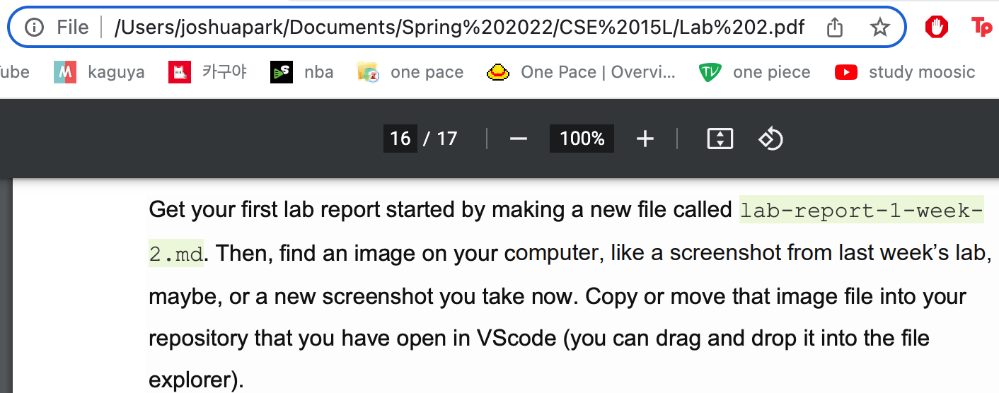
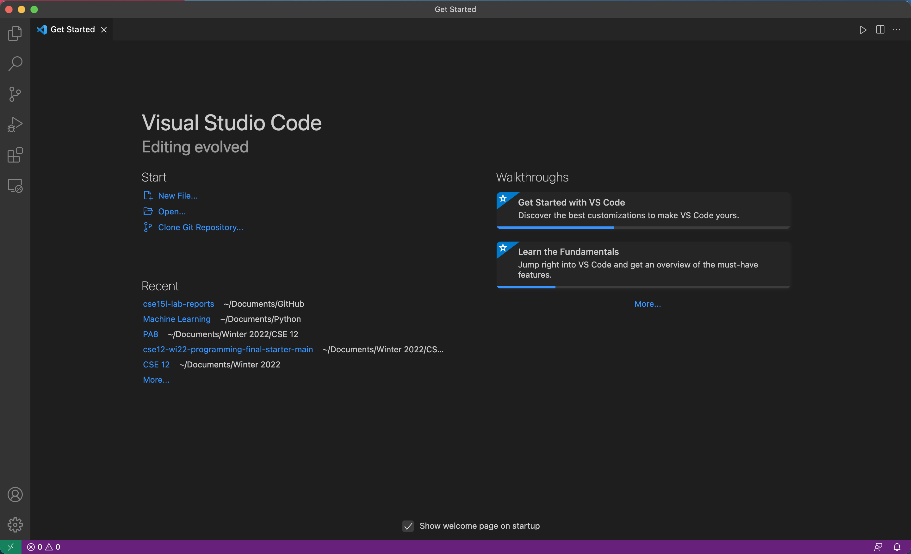
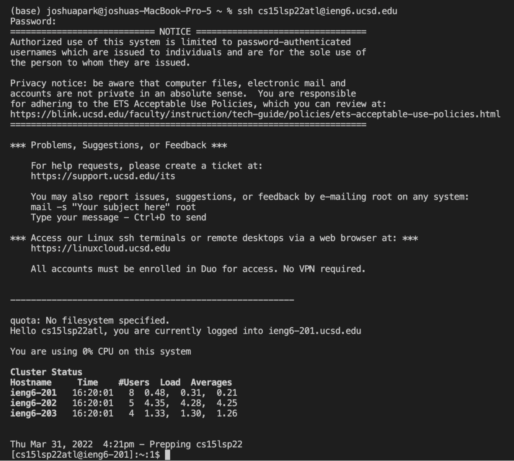
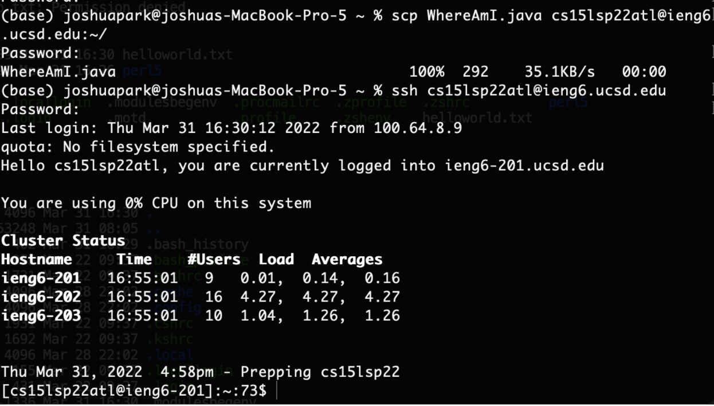

# Lab 1
### Joshua Park A16966614

&nbsp;

## Downloading VSCode:
* Go to [this link](https://code.visualstudio.com/download)
* It should like like this: 
* Click on the download button for your computer
* Complete the installations, and open VSCode
* You should see something like this: 
* Now you are done! Get to coding!

&nbsp;
## Remote Connecting
* Sometimes, we want to wirelessly connect to another computer and run commands there. The computer we connect to is called the _server_ and the computer we use is called the _client_.
* To remotely connect to the server, use the `ssh` command, followed by your username (for this writeup, I will use cs15lsp22atl@ieng6.ucsd.edu)
* Run the command in terminal (and enter your password): 
* Congratulations! You have succfessfully remotely connected to another computer!

&nbsp;
## Trying Some Commmands
* Run some commands! Here are common (and useful) commands:
* ls - shows the folders and files (also hidden ones if specified) within the current working directory
* pwd - prints the current working directory
* touch - creates new file
* cat - prints out contents of a file
* Here are some examples:

&nbsp;
## Moving Files with `scp`
* You can move files from the remote computer to the server using the `scp` command
* Use `scp` + [filename on your computer] + [your username] + [directry to place file on remote computer]
* Here is an example; I am moving the WhereAmI.java from my computer to the home directory `~/` of the remote computer:

&nbsp;
## Setting an SSH Key

&nbsp;
## Optimize Remote Running
