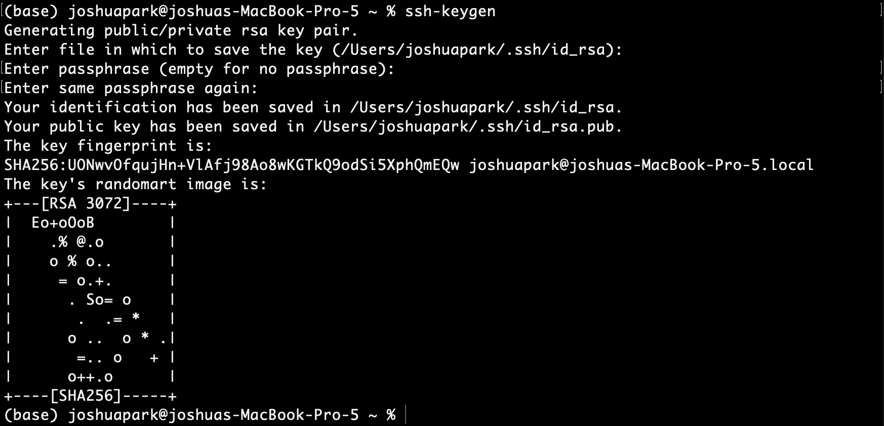
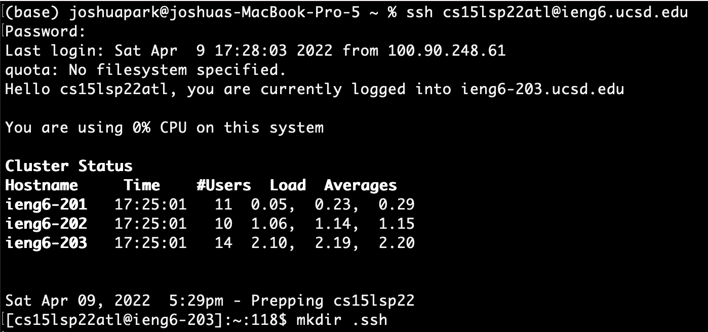
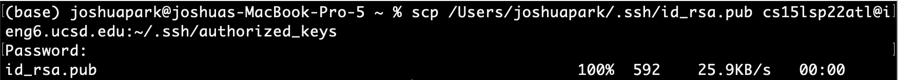
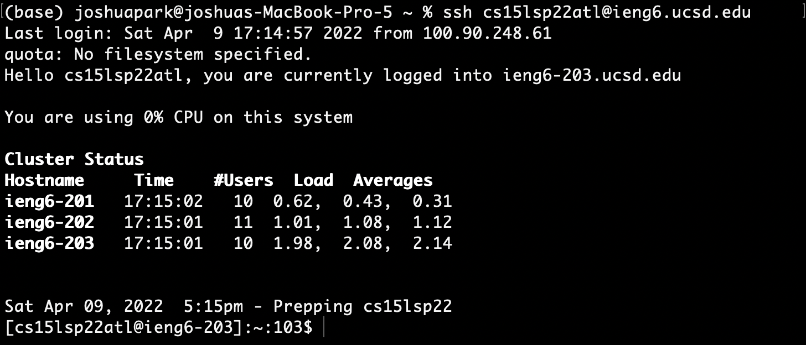
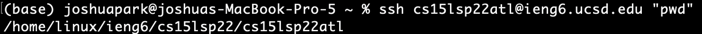
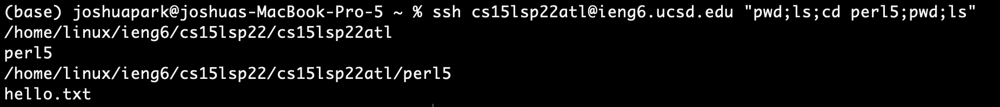
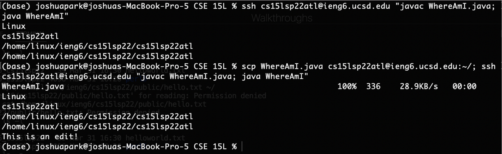

# Lab 1

This lab write up contains the activites finished during Week 1 of CSE 15L Spring 2022. The write up covers from VSCode installation to SSH key generation.

&nbsp;
## Downloading VSCode:
* Go to [this link](https://code.visualstudio.com/download)
* It should like like this: 
* Click on the download button for your computer
* Complete the installations, and open VSCode
* You should see something like this: 

&nbsp;
## Remote Connecting
* Sometimes, we want to wirelessly connect to another computer and run commands there. The computer we connect to is called the _server_ and the computer we use is called the _client_.
* To remotely connect to the server, use the `ssh` command, followed by your username (for this writeup, I will use cs15lsp22atl@ieng6.ucsd.edu)
* Run the command in terminal (and enter your password): 
* Congratulations! You have succfessfully remotely connected to another computer!

&nbsp;
## Trying Some Commmands
* Run some commands! Here are common (and useful) commands:
* ls - shows the folders and files (also hidden ones if specified) within the current working directory
* pwd - prints the current working directory
* touch - creates new file
* cat - prints out contents of a file
* Here are some examples:

&nbsp;
## Moving Files with `scp`
* You can move files from the remote computer to the server using the `scp` command
* Use `scp` + [filename on your computer] + [your username] + [directry to place file on remote computer]
* Here is an example; I am moving the WhereAmI.java from my computer to the home directory `~/` of the remote computer: 

&nbsp;
## Setting an SSH Key
* It's rather annoying having to input your password every time you use `ssh` or `scp` with your account. It would be nice if the server could recognize you without inputting your password.
* You can get do this by setting up something called SSH keys! Basically, you will send a local copy of your public key to the server and set up a private key inside your local machine. By doing so, whenever you `ssh` into your account the server will recognize you because you are the only one in the world who has the right 'access code' to unlock the account (given you haven't shared your private key, which you should **never** do). This way, you don't have to type into your password every time you try to access your account.
* Okay that was a mouthful! To summarize, you need to set up SSH keys on your local device and `scp` your public key to the server:
* First, generate your keys on your **local device** using the `ssh-keygen` command (just press enter and do not type anything):

* Now, log into the server and create an `.ssh` directory:

* Go back to your local machine, and `scp` your **public** (not private!) file key to your server.

* If you completed these steps correctly, it should look something like this!

&nbsp;
## Optimize Remote Running
* To optimize remote running, you can enter additional commands in quotes after the `ssh` to directly run on the remote server and exit.
* Here is an example:

* You can run multiple commands back to back by separating them with a semicolon `;`

* Let's make a local copy to `WhereAmI.java` then send it to the remote server and run it there:

* Let's break down what is going on: First, I compiled and ran the code on the server side to show the output of the original `WhereAmI.java` file. Then, I `scp`'d the file to the server, `ssh`'d into it, and ran the file once more. You can see that there is an additional line of output `This is an edit!`

&nbsp;
___
## Joshua Park
### jjp003@ucsd.edu
### A16966614
