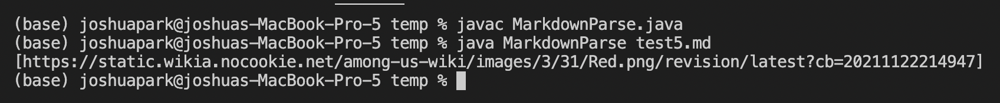

# Lab 2
This lab writeup contains the activities finished during Weeks 3-4 of CSE 15L Spring 2022. This writeup mainly focused on debugging and commit changes on Github.

&nbsp;
## Code Change 1
* Code change difference:

* [Failure inducing test file](https://github.com/Joshjppark/markdown-parser/blob/main/test-file.md)
* Symptom of bug:

* The bug in the program was that there were additional characters after the last close parenthesis (in this case, the additional characters were `\n`). The program could not find any more closed brackets after the last link, so the `indexOf` method returned `-1`. This caused the program to reset the search index whenever it reached the end of the test file, which induced an infinite loop. As you can see in the symptom above, the program ran indefinitely until it was forced stopped by the user.

&nbsp;
## Code Change 2
* Code change difference:

* [Failure inducing test file](https://github.com/Joshjppark/markdown-parser/blob/main/test2.md)
* Symptom of bug:

* The program does not check whether or not the text within the parenthesis is actually a link or not. In the case of the fail-inducing test file, the test file simply describes what brackets and parenthesis are in a convenient order that matches the order the program checks for them: `[`, `]`, `(`, `)`. This causes the program to think that the text between the parenthesis to be a link, so it returns "`\n this is a closed parenthesis` ".

&nbsp;
## Code Change 3
* Code change difference:

* [Failure inducing test file](https://github.com/Joshjppark/markdown-parser/blob/main/test5.md)
* Symptom of bug

* We want our program to return only links for files or websites, but not for images. However, the program does not check for this requirement. The test-inducing input contains an image link, but since the program cannot distinguish regular links from image links, the image link is returned.

&nbsp;
___
## Joshua Park
### jjp003@ucsd.edu
### A16966614
