# Lab 3
This lab writeup contains the activities finished during Week 5 of CSE 15L Spring 2022. This writeup mainly focuses on streamlining actions with the `ieng6` machines.

&nbsp;
## Streamlining ssh Configuration
* I edited my `.ssh/config` file using the `nano` command (as seen in the top in the picture below)
* I just copy and pasted the code from the Lab 5 writeup and specified my username.
* I also had to refer to my `id_rsa` file because it would not work without the line
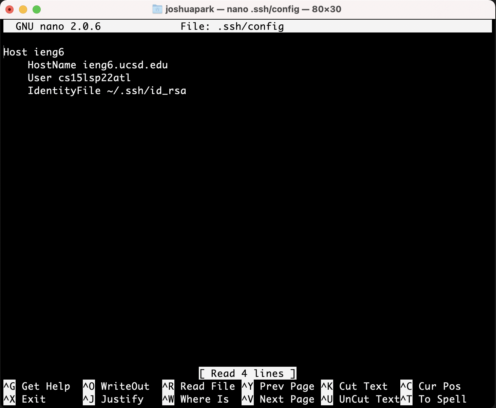
* Streamline logging into the `ieng6` account:
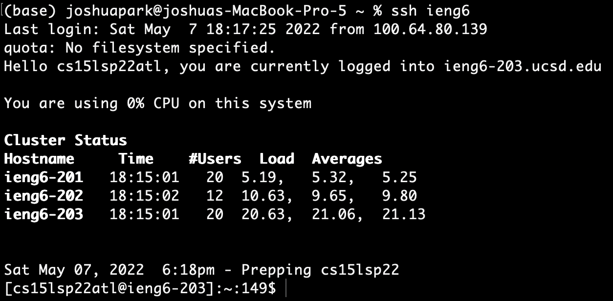
* Using `scp` with the alias:
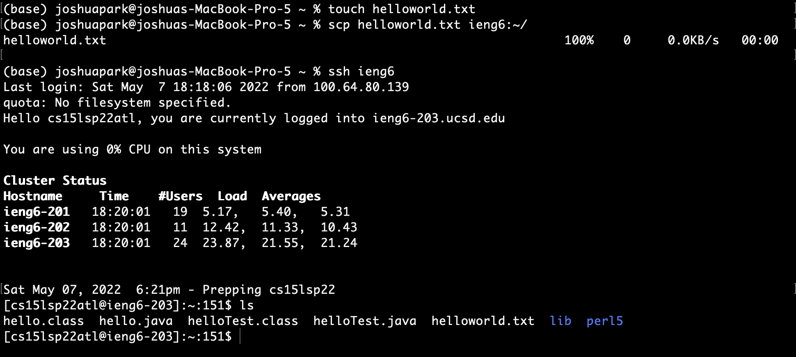

&nbsp;
## Setup Github Access from ieng6
* Public key on Github:
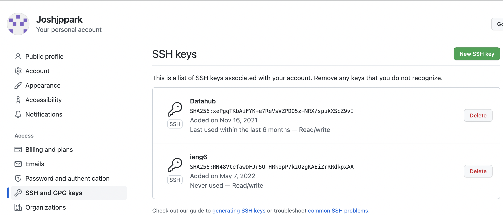
* Public and Private keys on `ieng6`:
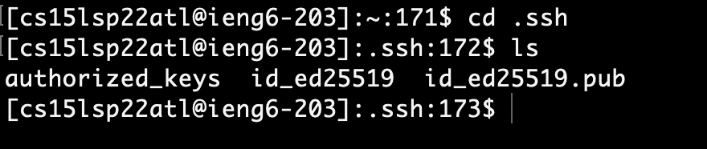

* Commiting and pushing change onto Github:
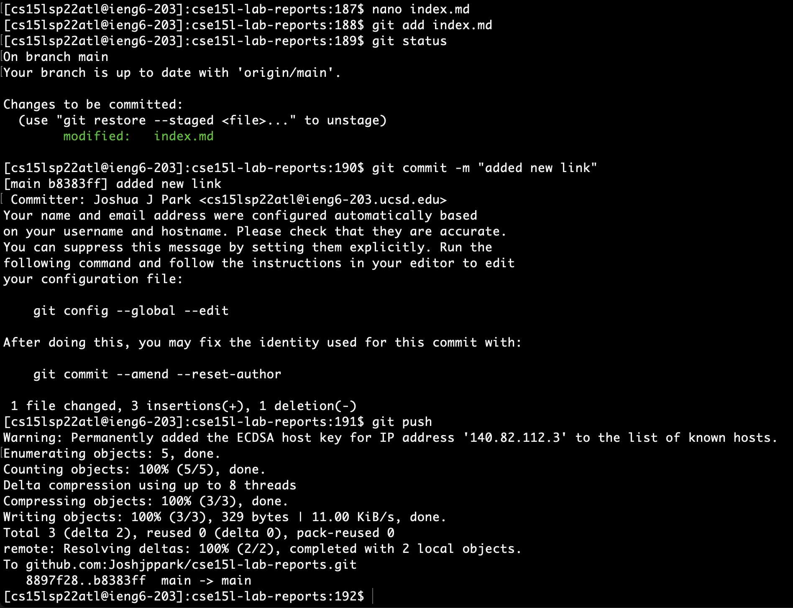

* [Commit link](https://github.com/Joshjppark/cse15l-lab-reports/commit/b8383fffe2a5f523a21b3a424b07040e88457f42)

&nbsp;
## Copy whole directories with `scp -r`
* Coping the `markdown-parse` directory to my `ieng6` account (screenshot only covers a portion of all the files copied):
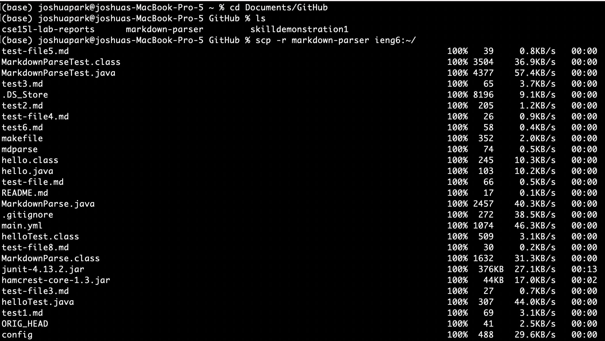
* Logging into `ieng6` to compile and run tests:
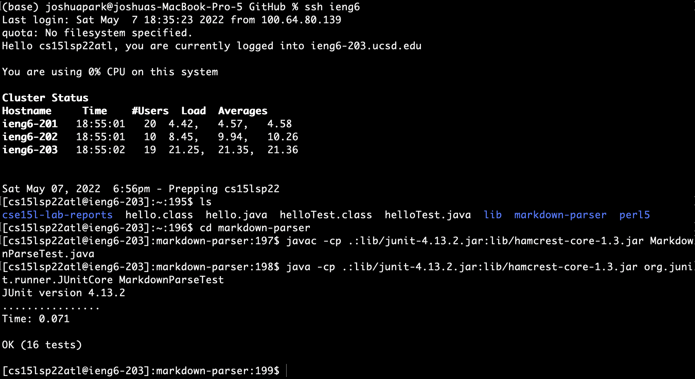
* I could also just use the `make test` command:
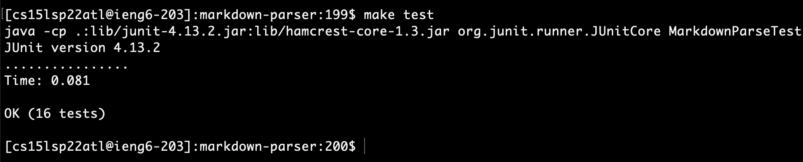
* Combining all commands into one line (I omitted the lines containing all of the downloaded files)
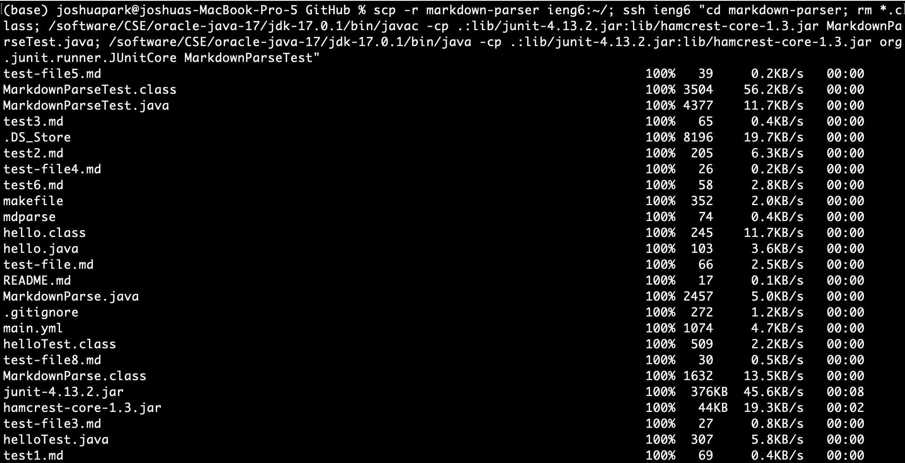
...
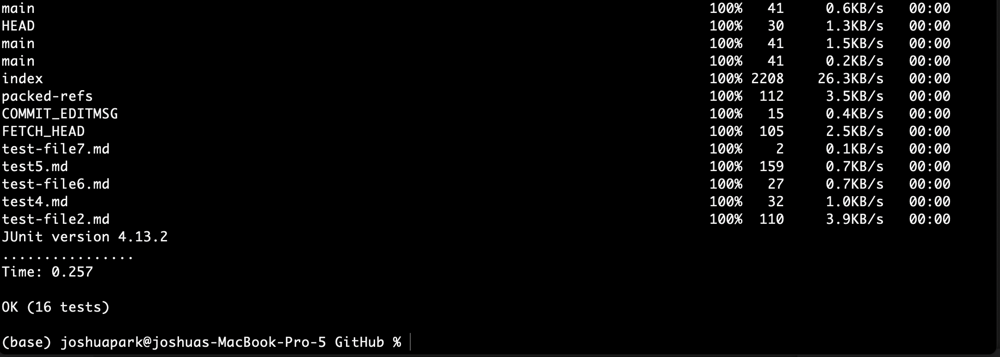
* To unpack what's going on here, first we copy the directory and `ssh` into the remote server using `scp -r markdown-parser ieng6:~/; ssh ieng6`
* Then, we `cd` into the copied directory and remove all the `.class` files runnin the command `cd markdown-parser; rm *.class;`
* Finally, we compile and run the test file using the command `/software/CSE/oracle-java-17/jdk-17.0.1/bin/javac -cp .:lib/junit-4.13.2.jar:lib/hamcrest-core-1.3.jar MarkdownParseTest.java; /software/CSE/oracle-java-17/jdk-17.0.1/bin/java -cp .:lib/junit-4.13.2.jar:lib/hamcrest-core-1.3.jar org.junit.runner.JUnitCore MarkdownParseTest`

&nbsp;
___
## Joshua Park
### jjp003@ucsd.edu
### A16966614