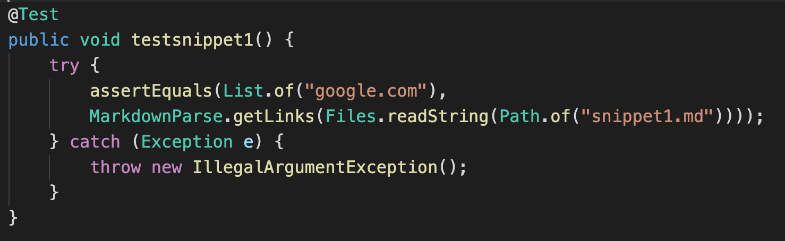
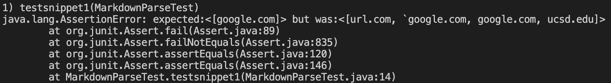
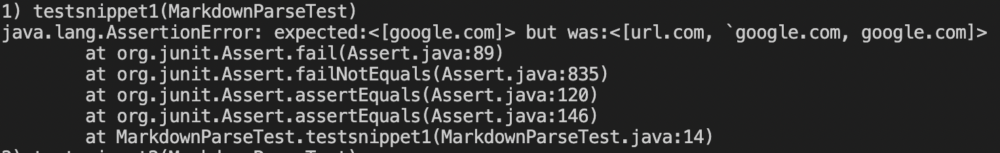
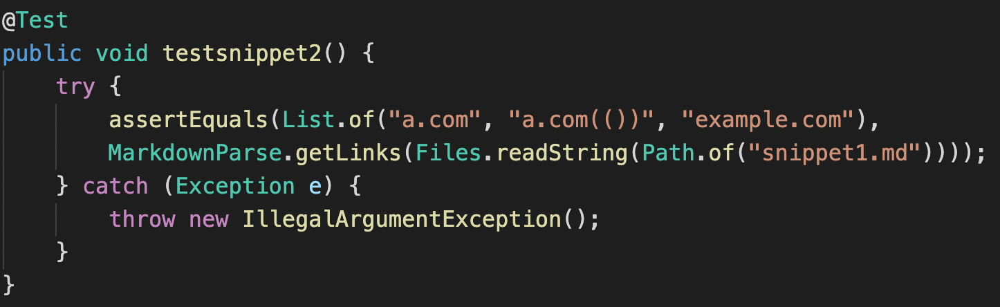
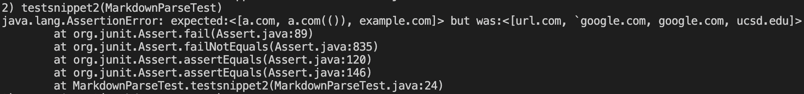
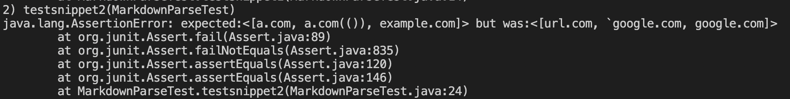
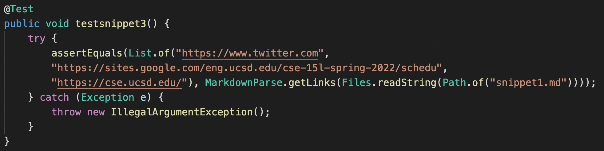
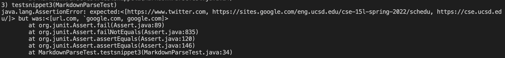

# Lab 4
This lab writeup contains the activities finished during Week 7 of CSE 15L Spring 2022.

[My github repo](https://github.com/Joshjppark/markdown-parser)

[Reviewed github repo](https://github.com/AlexVazquez19/markdown-parser-echidnas)

&nbsp;
## Snippet 1
* Expected output: `[google.com]`
* Code for test:

**My implementation**
* Did not pass:

**Reviewed implementation**
* Did not pass:

### Follow-up Question:
Yes, I think there is a small code change that will make the program work for snippet 1 and all related cases that use inline
code with backticks. This is because we can instantiate a new variable that keeps track of the number of backticks. If there are a odd number of backticks from the start of a program to an index of a open bracket, then the open bracket is included in a backtick thus is not part of a link. The usage of backticks can also be checked if the are within the bracket or parenthesis (This code would probably exeed a little bit over 10 lines for readability, but it is possible to compact).

&nbsp;
## Snippet 2
* Expected output: `[a.com, a.com(()), example.com]`
* Code for test:

**My implementation**
* Did not pass:

**Reviewed implementation**
* Did not pass:

### Follow-up Question:
No, I do not think there is a small code change that will make the program work for snippet 1 and all related cases that that nest parentheses, brackets, and escaped brackets. The code change would rely on a stack to keep track of nested parenthesis, and these parenthesis would also have to be compared to the indices of the open/close brackets of a potential link. In addition, another stack would also have to be used to keep track of nested brackets, which would require the code change to be bibgger than 10 simple lines.

&nbsp;
## Snippet 3
* Expected output: `[https://www.twitter.com, https://sites.google.com/eng.ucsd.edu/cse-15l-spring-2022/schedu, https://cse.ucsd.edu/]`
* Code for test:

**My implementation**
* Did not pass:

**Reviewed implementation**
* Did not pass:

### Follow-up Question:
Yes, I think there is a small code change that will make the program work for snippet 1 and all related cases that have newlines in brackets and parentheses. The program would have to simply first check if the next two characters are `\n` (which denote a newline). If that is the case, then the program would have to loop around the newline and ignore it without problem.

&nbsp;
___
## Joshua Park
### jjp003@ucsd.edu
### A16966614