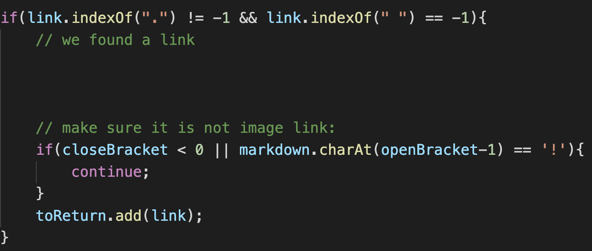

# Lab 5
This lab writeup contains the activities finished during Week 9 of CSE 15L Spring 2022. Specifically, this lab covers differing outputs of Markdown Parse with Multiple files. For both files, I used `vimdiff` to see the varying results of my version and the provided version.

&nbsp;
## Test File 421
*[link to file](https://github.com/nidhidhamnani/markdown-parser/blob/main/test-files/421.md)*

* `vimdiff` output:

* Here is the VScode preview of the file:

* Since `bar` is highlighted in blue, it directs to a link. In particular, it links to `/url`. Therefore, the provided version of Markdown-Parse is correct since the expected output is `[/url]`.
* My version does not output `[/url]` because it checks that a period "`.`" is within the link. If a period is not found, the text within the parenthesis is assumed to not be a link. Here is a code snippet:

* I added this functionality because most websites end with a period such as `.com`, `.org`, and `.gov`. Thus, checking for a period seems natural, but this functionality does not work with these test cases.
* To fix the program, the first `if` statement shown in the code snippet needs to be removed.

&nbsp;
## Test File 473
*[link to file](https://github.com/nidhidhamnani/markdown-parser/blob/main/test-files/473.md)*

* `vimdiff` output:

* Here is the VScode preview of the file:

* Since `bar` is highlighted in blue, it directs to a link. In particular, it links to `/url`. Therefore, the provided version of Markdown-Parse is once again correct since the expected output is `[/url]`.
* The bug in my program is the exact same issue that caused the error in test file 421: my program does not return a link if it does not include a period within the text. An in-depth explanation is provided above.

&nbsp;
___
## Joshua Park
### jjp003@ucsd.edu
### A16966614

&nbsp;
That concludes my last lab report for CSE15L Spring 2022! Thank you for providing a great experience and being patient with my education. I hope you guys have a great summer!